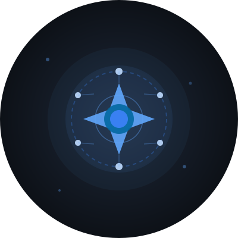
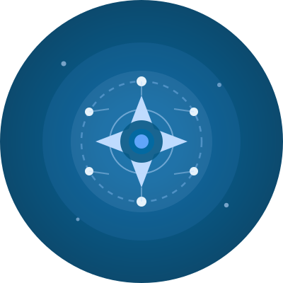
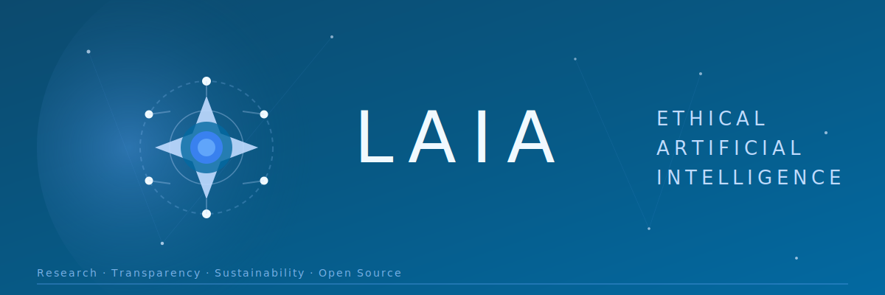
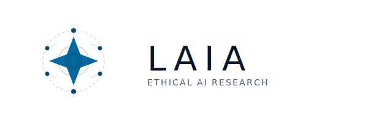
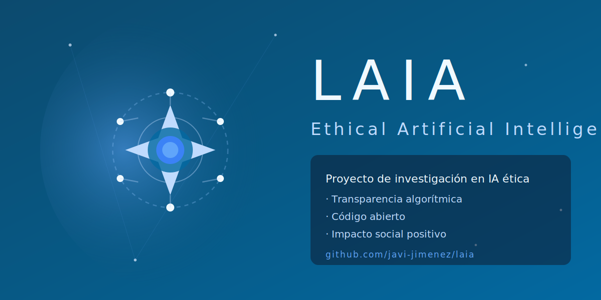

## La Identidad Visual de un Proyecto que Mira a las Estrellas

Cuando hablamos de **Laia**, hablamos de inteligencia artificial ética, transparencia y un futuro sostenible. La identidad visual del proyecto no es solo estética: es una declaración de principios visualizada.

### El Concepto: Inteligencia de las Estrellas

El diseño de Laia se inspira en tres conceptos fundamentales:

#### 🌟 **Las Estrellas como Metáfora**
Las estrellas representan:
- **Guía y orientación**: Como las estrellas han guiado a la humanidad durante milenios
- **Luz en la oscuridad**: Iluminar el camino de la IA ética
- **Aspiración**: Alcanzar las estrellas en innovación responsable
- **Conexión**: Las constelaciones conectan puntos, como las redes neuronales conectan conocimiento

#### 🔵 **La Paleta Azul**
El azul profundo y sus variantes simbolizan:
- **Confianza y profesionalidad**
- **Tecnología e innovación**
- **Serenidad y estabilidad**
- **El cosmos infinito de posibilidades**

#### 🔗 **La Red Neuronal**
Los nodos y conexiones representan:
- **Inteligencia artificial y aprendizaje**
- **Transparencia en los procesos**
- **Interconexión de ideas**
- **Colaboración abierta**

---

## El Sistema de Identidad Visual

### 1. Logo Principal


El logo principal combina:
- Estrella central de 8 puntas (símbolo de guía y dirección)
- Anillo orbital que sugiere movimiento y procesamiento continuo
- Nodos de red neuronal
- Tipografía limpia y moderna con espaciado amplio

**Uso**: Documentación oficial, presentaciones, web principal

---

### 2. Icono Compacto


Versión simplificada para:
- Favicon del sitio web
- Aplicaciones móviles
- Iconos de sistema
- Espacios reducidos

---

### 3. Avatar para Redes Sociales

#### GitHub Profile


Diseño oscuro optimizado para GitHub con:
- Fondo compatible con tema dark
- Alto contraste
- Esquema circular

#### Twitter/X Profile


Versión vibrante para redes sociales con:
- Colores más saturados
- Diseño que destaca en feeds
- Fondo degradado

#### LinkedIn Profile


Versión profesional con:
- Paleta corporativa
- Fondo más conservador
- Énfasis en seriedad

---

### 4. Banner para GitHub README



Banner panorámico (1200x400px) para:
- Parte superior del README.md
- Página principal del repositorio
- Documentación del proyecto

Incluye:
- Logo y nombre del proyecto
- Tagline: "Ethical Artificial Intelligence"
- Constelaciones animadas (en versión web)
- Efectos de luz y profundidad

---

### 5. Variantes de Color

#### Versión Light (para fondos claros)


#### Versión Dark (para fondos oscuros)


#### Versión Monocromática


---

### 6. Assets para Social Media Posts

#### Instagram Post Template


Formato cuadrado (1080x1080px) para:
- Posts de Instagram
- LinkedIn posts
- Facebook shares

#### Twitter Card


Formato 2:1 (1200x600px) para:
- Twitter cards
- Open Graph images
- Previews en enlaces compartidos

---

## Guía de Uso

### Espaciado y Área de Seguridad

El logo debe mantener un espacio libre equivalente a la altura de la letra "A" en LAIA alrededor de todos sus lados.

```
┌─────────────────────────────────┐
│          ÁREA LIBRE             │
│    ┌─────────────────┐          │
│    │                 │          │
│    │   LOGO LAIA     │          │
│    │                 │          │
│    └─────────────────┘          │
│          ÁREA LIBRE             │
└─────────────────────────────────┘
```

### Tamaños Mínimos

- **Logo completo**: No menor a 120px de ancho
- **Icono solo**: No menor a 32px
- **Favicon**: 16x16px, 32x32px, 64x64px

### Fondos Permitidos

✅ **Recomendados:**
- Azul marino oscuro (#0f172a - #1e293b)
- Blanco puro (#ffffff)
- Gris muy claro (#f8fafc)
- Degradados azules sutiles

❌ **Evitar:**
- Fondos con patrones complejos
- Colores que compitan con el azul del logo
- Imágenes de fondo sin overlay oscuro

### Paleta de Colores Oficial

```css
/* Colores Primarios */
--laia-blue-deep:    #0c4a6e  /* Azul profundo */
--laia-blue-primary: #0369a1  /* Azul principal */
--laia-blue-light:   #60a5fa  /* Azul claro */
--laia-blue-pale:    #bfdbfe  /* Azul pálido */

/* Colores Neutros */
--laia-dark:         #0f172a  /* Fondo oscuro */
--laia-slate:        #1e293b  /* Gris pizarra */
--laia-gray:         #94a3b8  /* Gris medio */
--laia-light:        #f0f9ff  /* Casi blanco */

/* Colores de Acento */
--laia-accent-cyan:  #06b6d4  /* Cyan */
--laia-accent-sky:   #38bdf8  /* Cielo */
```

---

## Filosofía del Diseño

### Minimalismo Significativo

Cada elemento tiene un propósito:
- **Estrella**: Guía, aspiración, claridad
- **Círculos orbitales**: Procesamiento continuo, ciclos de aprendizaje
- **Nodos**: Transparencia, red de conocimiento
- **Espacio negativo**: Respiro, claridad, accesibilidad

### Escalabilidad

El diseño funciona desde 16px (favicon) hasta tamaños de valla publicitaria sin perder legibilidad ni impacto visual.

### Versatilidad

Compatible con:
- Temas dark y light
- Impresión en blanco y negro
- Bordados y serigrafía
- Animaciones web
- Realidad aumentada (preparado para 3D)

### Accesibilidad

- Contraste mínimo WCAG AAA
- Legible para personas con daltonismo
- Funciona sin color (solo formas)
- Texto alternativo siempre disponible

---

## Recursos Descargables

Todos los assets SVG de este artículo están disponibles en este mismo post del blog. Puedes descargarlos directamente haciendo clic derecho sobre cada imagen y seleccionando "Guardar imagen como..." o accediendo a la carpeta del post:

```bash
content/posts/2025-12-18-laia-brand-identity/
├── laia-logo-main.svg
├── laia-logo-light.svg
├── laia-logo-dark.svg
├── laia-logo-mono.svg
├── laia-icon-compact.svg
├── laia-avatar-github.svg
├── laia-avatar-twitter.svg
├── laia-avatar-linkedin.svg
├── laia-banner-github.svg
├── laia-social-instagram.svg
└── laia-social-twitter-card.svg
```

### Estructura Futura Propuesta

Para organizar mejor los assets en el repositorio oficial de Laia, se recomienda crear una estructura como:

```bash
laia/                                 # Repositorio principal
├── brand/                           # Carpeta de identidad visual
│   ├── logo/                       # Variantes del logo
│   ├── icons/                      # Iconos en múltiples tamaños
│   ├── avatars/                    # Perfiles redes sociales
│   ├── banners/                    # Banners y headers
│   └── social/                     # Templates redes sociales
└── docs/
    └── brand-guidelines.md         # Guía de marca (este artículo)
```

---

## Aplicaciones en el Mundo Real

### Sitio Web
El diseño se adapta perfectamente a:
- Hero sections
- Headers y footers
- Loading screens
- Error pages (404, 500)

### Documentación
- Portadas de documentos técnicos
- Diagramas de arquitectura
- Presentaciones corporativas
- Material educativo

### Merchandising
- Camisetas y sudaderas
- Tazas y botellas
- Stickers y pegatinas
- Mochilas y bolsas

### Eventos
- Roll-ups y banners
- Slides de presentación
- Credenciales y lanyards
- Escenografía

---

## El Significado Profundo

Esta identidad visual no es casualidad. Cada decisión de diseño refleja los valores del proyecto:

### Transparencia
Los elementos están claramente definidos, sin trucos visuales ni complejidad innecesaria. Lo que ves es lo que es.

### Conexión
Los nodos conectados representan la naturaleza colaborativa del proyecto open source y la interconexión del conocimiento humano y artificial.

### Aspiración
La estrella apunta hacia arriba, simbolizando la ambición de alcanzar nuevas alturas en IA ética sin perder los pies del suelo.

### Universalidad
El diseño trasciende idiomas y culturas. Una estrella es una estrella en cualquier parte del mundo.

### Futuro y Tradición
Combina elementos futuristas (redes neuronales, tecnología) con símbolos atemporales (estrellas, que han guiado a la humanidad desde la antigüedad).

---

## Evolución de la Marca

Esta es la versión 1.0 de la identidad visual de Laia. Como el propio proyecto, está diseñada para evolucionar:

### Roadmap Visual

**2025-2026**: Fase actual
- Consolidación de la identidad base
- Creación de templates y recursos
- Feedback de la comunidad

**2027-2028**: Evolución
- Posibles animaciones más complejas
- Versiones 3D del logo
- Realidad aumentada para eventos

**2029+**: Madurez
- Sistema de diseño completo
- Sub-marcas para diferentes productos
- Adaptaciones culturales regionales

---

## Créditos y Licencia

### Diseño
Identidad visual creada específicamente para el proyecto Laia, reflejando su misión de inteligencia artificial ética, transparente y sostenible.

### Tipografía
- **Familia principal**: Segoe UI / Arial (universalmente disponibles)
- **Alternativas**: Inter, Open Sans para interfaces digitales
- **Espaciado**: Amplio (letter-spacing: 3-12px) para reflejar claridad

### Licencia
Los assets de marca están disponibles bajo Creative Commons Attribution 4.0 (CC BY 4.0) para:
- Promoción del proyecto
- Contenido educativo
- Material de conferencias
- Artículos y publicaciones

**Uso comercial**: Requiere aprobación previa del equipo Laia.

---

## Comunidad y Feedback

¿Tienes ideas para mejorar la identidad visual? ¿Has creado adaptaciones creativas?

**Comparte en:**
- GitHub Discussions: Ideas y propuestas
- Twitter: #LaiaProject #EthicalAI
- LinkedIn: Menciona @franciscojavierjimenezgomez

---

## Conclusión: Diseño con Propósito

La identidad visual de Laia no es solo un logo bonito. Es:

✨ Una **declaración de valores**  
🌟 Una **invitación a colaborar**  
🔵 Un **símbolo de confianza**  
🌍 Una **promesa de futuro mejor**

Cada vez que veas la estrella de Laia, recuerda: estamos construyendo inteligencia artificial que mira a las estrellas mientras mantiene los pies en la tierra, guiados por la ética, la transparencia y el bien común.

---

**Explora el proyecto completo:**  
🔗 [github.com/javi-jimenez/laia](https://github.com/javi-jimenez/laia)  
🌐 [laia.brisecom.org](https://laia.brisecom.org/)

**Usa los recursos:**  
📦 Todos los assets están en `/brand` en el repositorio  
📖 Brand Guidelines (PDF) disponible próximamente

---

*"Un buen diseño es tan poco diseño como sea posible. Pero debe contar una historia."* — Adaptado de Dieter Rams
