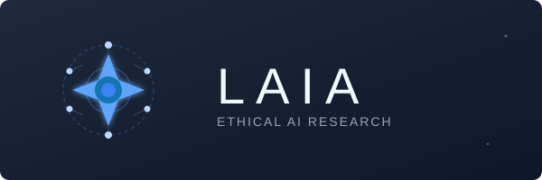
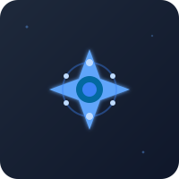
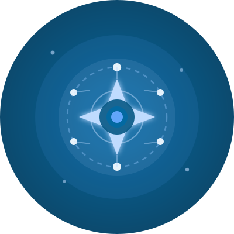
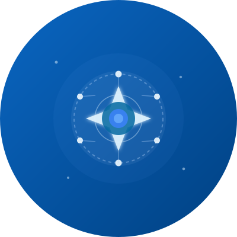
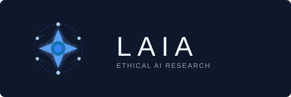
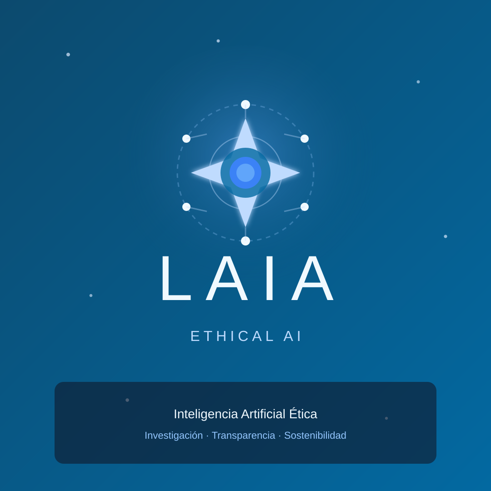

## The Visual Identity of a Project that Looks to the Stars

When we talk about **Laia**, we talk about ethical artificial intelligence, transparency and a sustainable future. The visual identity of the project is not just aesthetic: it is a visualized declaration of principles.

### The Concept: Intelligence of the Stars

Laia's design is inspired by three fundamental concepts:

#### 🌟 **Stars as Metaphor**
The stars represent:
- **Guidance and orientation**: How the stars have guided humanity for millennia
- **Light in the darkness**: Lighting the path of ethical AI
- **Aspiration**: Reach for the stars in responsible innovation
- **Connection**: Constellations connect points, like neural networks connect knowledge

#### 🔵 **The Blue Palette**
Deep blue and its variants symbolize:
- **Trust and professionalism**
- **Technology and innovation**
- **Serenity and stability**
- **The infinite cosmos of possibilities**

#### 🔗 **The Neural Network**
The nodes and connections represent:
- **Artificial intelligence and learning**
- **Transparency in processes**
- **Interconnection of ideas**
- **Open collaboration**


## The Visual Identity System

### 1. Main Logo



The main logo combines:
- Central 8-point star (guide and direction symbol)
- Orbital ring suggesting continuous movement and processing
- Neural network nodes
- Clean, modern typography with wide spacing

**Use**: Official documentation, presentations, main website


### 2. Compact Icon



Simplified version for:
- Website favicon
- Mobile applications
- System icons
- Small spaces


### 3. Avatar for Social Networks

#### GitHub Profile


Dark layout optimized for GitHub with:
- Background compatible with dark theme
- High contrast
- Circular scheme

#### Twitter/X Profile


Vibrant version for social networks with:
- More saturated colors
- Design that stands out in feeds
- Gradient background

#### LinkedIn Profile


Professional version with:
- Corporate palette
- More conservative background
- Emphasis on seriousness


### 4. Banner for GitHub README


Panoramic banner (1200x400px) for:
- Top of the README.md
- Repository main page
- Project documentation

Includes:
- Logo and name of the project
- Tagline: "Ethical Artificial Intelligence"
- Animated constellations (web version)
- Light and depth effects


### 5. Color Variants

#### Light version (for light backgrounds)


#### Dark version (for dark backgrounds)


#### Monochrome Version


### 6. Assets for Social Media Posts

#### Instagram Post Template


Square format (1080x1080px) for:
- Instagram Posts
- LinkedIn posts
-Facebook shares

#### Twitter Card


2:1 format (1200x600px) for:
-Twitter cards
- Open Graph images
- Previews on shared links


## Use Guide

### Spacing and Safety Area

The logo must maintain free space equivalent to the height of the letter "A" in LAIA around all sides.

```
┌─────────────────────────────────┐
│           CLEAR SPACE           │
│    ┌─────────────────┐          │
│    │                 │          │
│    │   LOGO LAIA     │          │
│    │                 │          │
│    └─────────────────┘          │
│           CLEAR SPACE           │
└─────────────────────────────────┘
```

### Minimum Sizes

- **Full logo**: No less than 120px wide
- **Icon only**: No less than 32px
- **Favicon**: 16x16px, 32x32px, 64x64px

### Allowed Backgrounds

✅ **Recommended:**
- Dark navy blue (#0f172a - #1e293b)
- Pure white (#ffffff)
- Very light gray (#f8fafc)
- Subtle blue gradients

❌ **Avoid:**
- Backgrounds with complex patterns
- Colors that compete with the blue of the logo
- Background images without dark overlay

### Official Color Palette
```css
/* Primary Colors */
--laia-blue-deep:    #0c4a6e  /* Deep blue */
--laia-blue-primary: #0369a1  /* Primary blue */
--laia-blue-light:   #60a5fa  /* Light blue */
--laia-blue-pale:    #bfdbfe  /* Pale blue */

/* Neutral Colors */
--laia-dark:         #0f172a  /* Dark background */
--laia-slate:        #1e293b  /* Slate gray */
--laia-gray:         #94a3b8  /* Medium gray */
--laia-light:        #f0f9ff  /* Almost white */

/* Accent Colors */
--laia-accent-cyan:  #06b6d4  /* Cyan */
--laia-accent-sky:   #38bdf8  /* Sky blue */
```


## Design Philosophy

### Meaningful Minimalism

Each element has a purpose:
- **Star**: Guidance, aspiration, clarity
- **Orbital circles**: Continuous processing, learning cycles
- **Nodes**: Transparency, knowledge network
- **Negative space**: Breath, clarity, accessibility

### Scalability

The design works from 16px (favicon) to billboard sizes without losing readability or visual impact.

### Versatility

Compatible with:
- Dark and light themes
- Black and white printing
- Embroidery and screen printing
- Web animations
- Augmented reality (3D ready)

### Accessibility

- WCAG AAA minimum contrast
- Readable for people with color blindness
- Works without color (shapes only)
- Alt text always available


## Downloadable Resources

All SVG assets for this article are available in this same blog post. You can download them directly by right clicking on each image and selecting "Save image as..." or by accessing the post folder:

```bash
content/posts/2025-12-18-laia-brand-identity/
├── laia-logo-main.svg
├── laia-logo-light.svg
├── laia-logo-dark.svg
├── laia-logo-mono.svg
├── laia-icon-compact.svg
├── laia-avatar-github.svg
├── laia-avatar-twitter.svg
├── laia-avatar-linkedin.svg
├── laia-banner-github.svg
├── laia-social-instagram.svg
└── laia-social-twitter-card.svg
```

### Proposed Future Structure

To better organize the assets in the official Laia repository, it is recommended to create a structure like:

```bash
laia/                                 # Main repository
├── brand/                           # Visual identity folder
│   ├── logo/                       # Logo variants
│   ├── icons/                      # Icons in multiple sizes
│   ├── avatars/                    # Social media profiles
│   ├── banners/                    # Banners and headers
│   └── social/                     # Social media templates
└── docs/
  └── brand-guidelines.md         # Brand guidelines (this article)
```


## Real World Applications

### Website
The design adapts perfectly to:
- Hero sections
- Headers and footers
- Loading screens
- Error pages (404, 500)

### Documentation
- Covers of technical documents
- Architecture diagrams
- Corporate presentations
- Educational material

### Merchandising
- T-shirts and sweatshirts
- Cups and bottles
- Stickers and stickers
- Backpacks and bags

### Events
- Roll-ups and banners
- Presentation slides
- Credentials and lanyards
- Scenography


## The Deep Meaning

This visual identity is no coincidence. Each design decision reflects the values of the project:

### Transparency
The elements are clearly defined, without visual tricks or unnecessary complexity. What you see is what it is.

### Connection
The connected nodes represent the collaborative nature of the open source project and the interconnection of human and artificial knowledge.

### Aspiration
The star points upward, symbolizing the ambition to reach new heights in ethical AI without losing its feet on the ground.

### Universality
Design transcends languages and cultures. A star is a star anywhere in the world.

### Future and Tradition
It combines futuristic elements (neural networks, technology) with timeless symbols (stars, which have guided humanity since ancient times).


## Brand Evolution

This is version 1.0 of Laia's visual identity. Like the project itself, it is designed to evolve:

### Visual Roadmap

**2025-2026**: Current phase
- Consolidation of the base identity
- Creation of templates and resources
- Community feedback

**2027-2028**: Evolution
- Possible more complex animations
- 3D versions of the logo
- Augmented reality for events

**2029+**: Maturity
- Complete design system
- Sub-brands for different products
- Regional cultural adaptations


## Credits and License

### Design
Visual identity created specifically for the Laia project, reflecting its mission of ethical, transparent and sustainable artificial intelligence.

### Typography
- **Main family**: Segoe UI / Arial (universally available)
- **Alternatives**: Inter, Open Sans for digital interfaces
- **Spacing**: Wide (letter-spacing: 3-12px) to reflect clarity

### License
Brand assets are available under Creative Commons Attribution 4.0 (CC BY 4.0) for:
- Project promotion
- Educational content
- Conference material
- Articles and publications

**Commercial use**: Requires prior approval from the Laia team.


## Community and Feedback

Do you have ideas to improve visual identity? Have you created creative adaptations?

**Share on:**
- GitHub Discussions: Ideas and proposals
- Twitter: #LaiaProject #EthicalAI
- LinkedIn: Mention @franciscojavierjimenezgomez


## Conclusion: Design with Purpose

Laia's visual identity is not just a pretty logo. It is:

✨ A **statement of values**  
🌟 An **invitation to collaborate**  
🔵 A **symbol of trust**  
🌍 A **promise of a better future**

Every time you see Laia's star, remember: we are building artificial intelligence that looks to the stars while keeping its feet on the ground, guided by ethics, transparency and the common good.


**Explore the full project:**  
🔗 [github.com/javi-jimenez/laia](https://github.com/javi-jimenez/laia)  
🌐 [laia.brisecom.org](https://laia.brisecom.org/)

**Use the resources:**  
📦 All assets are in `/brand` in the repository  
📖 Brand Guidelines (PDF) coming soon

---

*"Good design is as little design as possible. But it must tell a story."* — Adapted from Dieter Rams