## Laia: La que habla dulce o se expresa con claridad

**Laia** es un nombre de mujer en catalán que significa "la que habla dulce o la que se expresa con claridad". Alguien que es sabio se suele expresar con buenas palabras y con claridad. Este nombre simboliza perfectamente la misión del proyecto: crear inteligencia artificial ética, transparente y comprensible.

## Presentando el Proyecto Laia

**Laia** es una iniciativa de investigación de código abierto fundada por Francisco Javier Jiménez Gómez de Brisecom, dedicada a avanzar en las consideraciones éticas de la inteligencia artificial (IA). El proyecto representa la intersección entre la innovación tecnológica, la ética aplicada y el compromiso con el bien común.

### Visión y Misión del Proyecto

El proyecto Laia se centra en desarrollar sistemas de inteligencia artificial que prioricen:

- **Ética por diseño**: Incorporar principios éticos desde las primeras fases del desarrollo
- **Transparencia algorítmica**: Decisiones de IA comprensibles y auditables
- **Impacto social positivo**: Tecnología al servicio del bienestar humano
- **Sostenibilidad digital**: IA responsable con el medio ambiente
- **Democratización del conocimiento**: Acceso abierto a investigación y herramientas

## Enfoque Actual

El proyecto se encuentra actualmente en su fase de preparación e investigación inicial, con foco en:

### 1. **Investigación Fundamental**
- Desarrollo de frameworks éticos para IA
- Análisis de sesgos algorítmicos
- Estudio de impactos sociales de la automatización
- Metodologías de transparencia en machine learning

### 2. **Aplicaciones Prioritarias**

#### Salud
- Sistemas de diagnóstico asistido transparentes
- Análisis predictivo ético en medicina personalizada
- Herramientas de apoyo para profesionales sanitarios

#### Educación
- Plataformas de aprendizaje adaptativo justas
- Sistemas de tutoría inteligente accesibles
- Democratización del acceso a educación de calidad

#### Cambio Climático
- Modelos predictivos para gestión ambiental
- Optimización de recursos energéticos
- Sistemas de monitoreo de sostenibilidad

### 3. **Stack Tecnológico Planificado**

El proyecto está diseñado para utilizar herramientas probadas en proyectos grandes de código abierto:

**Desarrollo de Modelos:**
- PyTorch / TensorFlow
- Hugging Face Transformers
- Scikit-learn

**Procesamiento de Datos:**
- Apache Spark
- Pandas / NumPy
- Apache Airflow (automatización)

**Infraestructura:**
- Kubernetes (orquestación)
- Docker (contenedores)
- PostgreSQL (base de datos)
- Prometheus & Grafana (monitoreo)

**Colaboración:**
- Mattermost (comunicación)
- Nextcloud (colaboración)
- Wiki.js (documentación)
- Taiga (gestión ágil)

## Arquitectura del Proyecto

El proyecto contempla una arquitectura escalable y modular basada en principios de cloud computing:

### Componentes Principales

```
┌─────────────────────────────────────────┐
│     API Gateway & Autenticación         │
├─────────────────────────────────────────┤
│  Servicios Core                         │
│  - Autenticación OAuth2/JWT             │
│  - Procesamiento de IA                  │
│  - Almacenamiento Distribuido           │
│  - Colaboración en Tiempo Real          │
├─────────────────────────────────────────┤
│  Capa de Datos                          │
│  - SQL (PostgreSQL)                     │
│  - NoSQL (almacenamiento distribuido)   │
├─────────────────────────────────────────┤
│  Seguridad & Monitoreo                  │
│  - Cifrado TLS/SSL, AES-256             │
│  - Auditoría (ELK Stack)                │
│  - Monitoreo (Prometheus/Grafana)       │
└─────────────────────────────────────────┘
```

### Principios de Diseño

1. **Escalabilidad Horizontal**: Balanceadores de carga y auto-scaling
2. **Alta Disponibilidad**: Replicación multi-región
3. **Recuperación ante Desastres**: Backups automatizados y plan de recuperación
4. **Seguridad por Capas**: Múltiples niveles de protección
5. **Interoperabilidad**: APIs REST estándar y formatos abiertos

## Roadmap del Proyecto

El proyecto contempla un desarrollo en fases de largo plazo (2023-2035):

### Fase 1: Preparación (Q4 2023)
- Constitución del equipo inicial
- Diseño de infraestructura
- Documentación fundamental
- Búsqueda de financiación

### Fase 2: Desarrollo Inicial (2024-2025)
- Prototipo funcional
- Primeros modelos éticos de IA
- Colaboraciones estratégicas
- Validación técnica y ética

### Fase 3: Expansión y Validación (2025-2027)
- Implementación en proyectos piloto
- Escalabilidad del sistema
- Evaluación de impacto social
- Expansión de casos de uso

### Fase 4: Consolidación (2027-2030)
- Expansión global
- Nuevas funcionalidades
- Educación masiva
- Estándares de industria

### Fase 5: Liderazgo Global (2030-2035)
- Referencia internacional en IA ética
- Influencia en políticas públicas
- Ecosistema de innovación sostenible

## Sectores de Aplicación

Laia tiene potencial de impacto en múltiples sectores:

### 🏥 **Sector Sanitario**
- Diagnóstico asistido por IA transparente
- Medicina personalizada ética
- Gestión hospitalaria optimizada
- Telemedicina accesible

### 🎓 **Educación**
- Plataformas de e-learning adaptativas
- Sistemas de tutoría personalizada
- Análisis de rendimiento académico justo
- Democratización del conocimiento

### 🌍 **Medio Ambiente**
- Predicción climática precisa
- Optimización energética
- Gestión de recursos hídricos
- Monitoreo de biodiversidad

### 🏙️ **Smart Cities**
- Gestión de tráfico inteligente
- Servicios públicos optimizados
- Planificación urbana sostenible
- Seguridad ciudadana ética

### 💼 **Empresas y PYMEs**
- Automatización de procesos administrativos
- Análisis de datos empresariales
- Sistemas de recomendación éticos
- Optimización de recursos

### 🏛️ **Sector Público**
- Servicios ciudadanos digitales
- Análisis de políticas públicas
- Detección de fraude transparente
- Planificación presupuestaria

## Llamado a la Colaboración

Laia es un proyecto que requiere apoyo y colaboración para hacerse realidad. Se busca:

### Inversores Ángel y Subvenciones
- Inversores interesados en ética en IA
- Instituciones con financiación flexible
- Programas de grants para investigación

### Colaboradores
- Investigadores en IA y ética
- Desarrolladores de software open source
- Expertos en dominios específicos (salud, educación, etc.)
- Especialistas en políticas públicas

### Mentores
- Profesionales experimentados en IA
- Líderes de proyectos de código abierto
- Expertos en sostenibilidad de proyectos

### Difusión
- Compartir el proyecto en redes
- Conectar con instituciones relevantes
- Participar en debates sobre IA ética

## Cómo Involucrarse

### Explorar el Proyecto
🔗 **Repositorio GitHub:** [github.com/javi-jimenez/laia](https://github.com/javi-jimenez/laia)

### Apoyar Financieramente
- [GitHub Sponsors](https://github.com/sponsors/javi-jimenez)
- [PayPal](https://www.paypal.me/brisecom)
- [Web del Proyecto](https://laia.brisecom.org/)

### Contacto
- LinkedIn: [Francisco Javier Jiménez Gómez](https://www.linkedin.com/in/ximenezfrancisco/)
- Red Brisecom
- Issues en GitHub

## Reflexión Final: IA al Servicio del Bien Común

Laia representa más que un proyecto tecnológico. Es una declaración de principios sobre cómo debe desarrollarse la inteligencia artificial en el siglo XXI:

### Principios Fundamentales

**Democratización:** La IA no debe ser privilegio de grandes corporaciones. Debe ser accesible para organizaciones de todos los tamaños y países de todos los niveles de desarrollo.

**Transparencia:** Los algoritmos que toman decisiones que afectan a las personas deben ser comprensibles y auditables. Las "cajas negras" son incompatibles con una sociedad democrática.

**Ética por Diseño:** Los principios éticos no pueden ser un añadido posterior. Deben estar integrados desde las primeras líneas de código.

**Sostenibilidad:** La IA debe contribuir a resolver los desafíos globales (cambio climático, desigualdad, salud) en lugar de agravarlos.

**Código Abierto:** El conocimiento debe compartirse. Solo así se puede garantizar la revisión por pares, la mejora continua y el beneficio colectivo.

### El Futuro que Queremos Construir

En un mundo donde la IA está transformando cada aspecto de nuestras vidas, proyectos como Laia son esenciales. No basta con desarrollar tecnología potente; debemos desarrollar tecnología **buena** - en el sentido ético y moral.

Laia busca ser un faro que ilumine el camino hacia una IA:
- Que respete la dignidad humana
- Que reduzca desigualdades en lugar de ampliarlas
- Que sea transparente y rendición de cuentas
- Que contribuya al bien común
- Que sea sostenible para nuestro planeta

### Un Llamado a la Acción

Este proyecto necesita de una comunidad comprometida. Si crees en una IA ética, transparente y al servicio de la humanidad, tu participación es valiosa:

- **Comparte** el proyecto con tu red
- **Contribuye** con código, documentación o ideas
- **Apoya** financieramente si puedes
- **Debate** sobre los desafíos éticos de la IA
- **Conecta** el proyecto con instituciones relevantes

Juntos podemos construir tecnologías de IA esenciales para un futuro digital sostenible.


**Website:** [laia.brisecom.org](https://laia.brisecom.org/)  
**GitHub:** [github.com/javi-jimenez/laia](https://github.com/javi-jimenez/laia)  
**LinkedIn:** [Francisco Javier Jiménez Gómez](https://www.linkedin.com/in/ximenezfrancisco/)

**Etiquetas:** #AIÉtica #InteligenciaArtificial #OpenSource #Investigación #Transparencia #BienComún #Sostenibilidad

---

*"La verdadera medida de la inteligencia artificial no está en lo que puede hacer, sino en cómo mejora la vida de las personas mientras respeta sus derechos y dignidad."*
