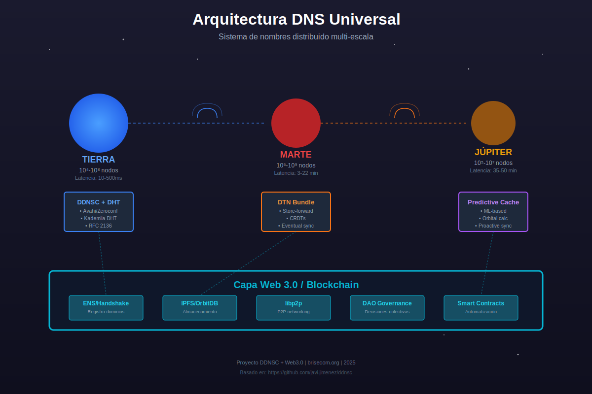

## Introducción: El Problema del Direccionamiento Universal

El **Domain Name System (DNS)** actual funciona bajo supuestos terrestres: latencias medidas en milisegundos, infraestructura física concentrada, y una autoridad central (ICANN). Pero ¿qué ocurre cuando necesitamos direccionar servicios en una colonia marciana, en estaciones orbitales, o incluso entre sistemas estelares?

El proyecto [DDNSC (Distributed DNS Cache)](https://github.com/javi-jimenez/ddnsc) proporciona los cimientos técnicos para resolver este problema mediante **publicación descentralizada de servicios** usando protocolos estándar (RFC 2136, Avahi/Zeroconf). Este artículo propone una extensión conceptual hacia escalas planetarias, galácticas y universales, integrando tecnologías Web 3.0 y protocolos emergentes.

## El Proyecto DDNSC: Base Tecnológica

### Arquitectura Actual

DDNSC permite que cualquier nodo publique sus propios servicios en servidores DNS remotos sin autorización centralizada:

- **Cliente**: Script `avahi-publish-remote.sh` que usa `nsupdate` (RFC 2136)
- **Servidor**: Bind con zonas dinámicamente actualizables
- **Descubrimiento**: Avahi para búsqueda de servicios (similar a mDNS/Bonjour)
- **Distribución**: Anycast para replicar servidores DNS por zonas

```bash
# Publicar un servicio SSH en dominio ddns
./avahi_publish_remote_service myssh _ssh._tcp 22 ddns

# Publicar automáticamente todas las IPs del host
avahi_publish_remote_myips ddns
```

### Limitación Actual: Escala ~1000 Nodos

El propio proyecto reconoce que la escalabilidad se limita a ~1000 nodos en su forma actual. Necesitamos arquitectura distribuida verdadera para escalas mayores.



## Escalabilidad: De Planetario a Universal

### Nivel 1: Escala Planetaria (10⁴ - 10⁸ nodos)

**Contexto**: Redes comunitarias terrestres, IoT masivo, ciudades inteligentes.

**Desafíos técnicos**:
- Latencia máxima: 100-500 ms (round-trip terrestre)
- Sincronización entre zonas horarias
- Resiliencia ante particiones de red regionales

**Soluciones propuestas**:

1. **Jerarquía geográfica multi-capa**:
   ```
   .earth → .continent → .country → .region → .local
   ejemplo: server.barcelona.catalunya.europe.earth
   ```

2. **DHT (Distributed Hash Table) para resolución**:
   - Protocolo Kademlia (usado en BitTorrent, IPFS)
   - Cada nodo mantiene tabla de ~log(N) vecinos
   - Resolución en O(log N) saltos

3. **Blockchain ligera para autoridad**:
   - Namecoin o Ethereum Name Service (ENS) para registro de dominios
   - Proof-of-Authority en lugar de PoW para eficiencia

**Cálculo de capacidad**:

| Parámetro | Valor |
|-----------|-------|
| Nodos totales | 10⁸ (100 millones) |
| Tamaño de tabla DHT por nodo | log₂(10⁸) ≈ 27 entradas |
| Memoria por entrada | 100 bytes (ID + IP + metadata) |
| **Memoria total por nodo** | **2.7 KB** |
| Saltos de resolución promedio | log₂(10⁸)/2 ≈ 14 saltos |
| Latencia por salto | 20 ms (promedio terrestre) |
| **Tiempo de resolución total** | **~280 ms** |

### Nivel 2: Escala Galáctica (10⁹ - 10¹² nodos)

**Contexto**: Sistema solar colonizado (Luna, Marte, cinturón de asteroides, lunas de Júpiter/Saturno).

**Desafíos técnicos**:
- Latencia variable: 3 min (Tierra-Marte en oposición cercana) a 22 min (oposición lejana)
- Particiones de red inevitables durante conjunciones solares
- Movimiento orbital constante de los nodos

**Soluciones propuestas**:

1. **Modelo de consistencia eventual**:
   - CRDT (Conflict-free Replicated Data Types) para registros DNS
   - Inspirado en CassandraDB y Amazon Dynamo
   - Cada planeta mantiene caché completa con timestamps

2. **Protocolo Delay-Tolerant Networking (DTN)**:
   - RFC 4838 - Bundle Protocol
   - Usado por NASA en comunicaciones espaciales profundas
   - Store-and-forward con reconocimientos programados

3. **Resolución predictiva**:
   - Precalcular órbitas y ventanas de comunicación
   - Caché proactiva basada en efemérides
   - Algoritmo: "Resolver antes de que se solicite"

**Jerarquía propuesta**:
```
.sol → .planet → .settlement → .district → .host
ejemplos:
- gateway.olympuscity.mars.sol
- research.europamission.jupiter.sol
- mining.ceres.asteroid.sol
```



**Cálculo de latencia interplanetaria**:

| Ruta | Distancia min (UA) | Latencia luz (min) | Ventana de comunicación |
|------|-------------------|-------------------|------------------------|
| Tierra-Luna | 0.0026 | 1.3 segundos | Continua |
| Tierra-Marte | 0.38 | 3.2 | 80% del año (evitando conjunciones) |
| Tierra-Júpiter | 4.2 | 35 | 70% del año |
| Tierra-Saturno | 8.0 | 67 | 65% del año |
| Tierra-Nube de Oort | 50,000 | 0.8 años | Requerido relay |

### Nivel 3: Escala Universal (10¹³+ nodos)

**Contexto**: Civilización multi-estelar (ciencia ficción dura, proyecto de investigación teórica).

**Desafíos técnicos**:
- Latencias de años-luz (4.2 años a Alpha Centauri)
- Imposibilidad física de consenso global
- Equivalencia conceptual con universos desconectados

**Modelo propuesto: "Federación de Universos DNS"**:

Cada sistema estelar opera como **universo DNS independiente** con federación opcional:

1. **Autoridad local absoluta**:
   - Cada estrella es TLD: `.alphacen`, `.sirius`, `.kepler442`
   - No requiere consenso con otros sistemas
   - Propiedad comunal del sistema estelar

2. **Relay interestelar**:
   - Naves que viajan entre sistemas llevan "paquetes de actualización"
   - Similar a Sneakernet pero a escala interestelar
   - Protocolo: "eventual consistency with years of delay"

3. **Nombres federados opcionales**:
   ```
   .galaxy.milkyway → .arm → .sector → .system → .planet
   ejemplo: station.newearth.alphacen.orion.milkyway.galaxy
   ```

**Cálculo de capacidad teórica**:

| Escala | Nodos estimados | Tiempo de sincronización completa |
|--------|----------------|----------------------------------|
| Sistema solar | 10⁹ | Horas (DTN) |
| 100 años-luz (esfera local) | 10¹² | Siglos (imposible sincronización real-time) |
| Galaxia Vía Láctea | 10¹⁵ | 100,000 años (solo federación histórica) |
| Universo observable | 10²⁴+ | Imposible (causalidad física) |

## Organización: Gobernanza Descentralizada

### Modelo para brisecom.org

**Propuesta organizativa** inspirada en Internet Engineering Task Force (IETF) y ICANN, pero descentralizada:

#### Estructura de la Fundación

1. **Comité Técnico** (5-7 miembros)
   - Especificaciones de protocolos
   - Auditoría de implementaciones
   - Revisión de RFCs

2. **Consejo de Gobernanza** (rotativo, basado en contribuciones)
   - Asignación de TLDs planetarios/galácticos
   - Resolución de conflictos de nombres
   - Votación: 1 nodo activo = 1 voto

3. **Grants de Investigación**
   - Financiación mediante criptomonedas (DAO)
   - Revisión peer-to-peer de propuestas
   - Transparencia total en blockchain

#### Modelo de Financiación

```
Fuentes de ingresos:
├── Donaciones criptográficas (ETH, BTC)
├── Grants de investigación espacial (NASA, ESA, SpaceX)
├── Venta de nombres premium en subastas (.mars, .io de Júpiter)
├── Servicios de consultoría para redes comunitarias
└── Publicaciones académicas y patentes abiertas

Distribución:
├── 60% Salarios equipo investigación (incluyendo tu rol)
├── 20% Infraestructura servidores y experimentos
├── 15% Grants a proyectos externos
└── 5% Reserva operativa
```

### Gobernanza Web 3.0

**DAO (Decentralized Autonomous Organization)** para decisiones críticas:

- **Contrato inteligente en Ethereum**:
  - Cada implementación del protocolo = 1 token de voto
  - Propuestas on-chain con período de votación
  - Ejecución automática de decisiones aprobadas

- **IPFS para almacenamiento**:
  - Registros DNS históricos en IPFS
  - Content addressing: `/ipns/ddnsc.brisecom.org`
  - Inmutabilidad y censorship-resistant

## Protocolos y Proyectos Relacionados

### Ecosistema Web 3.0

| Proyecto | Relevancia | Integración propuesta |
|----------|-----------|----------------------|
| **ENS (Ethereum Name Service)** | Nombres descentralizados en blockchain | Backend de autoridad para TLDs premium |
| **IPFS/IPNS** | Almacenamiento distribuido content-addressed | Replicación de zonas DNS, caché distribuida |
| **libp2p** | Stack de networking peer-to-peer | Capa de transporte para nodos DDNSC |
| **Handshake (HNS)** | Blockchain DNS alternativo descentralizado | Competidor/complemento para registro raíz |
| **OrbitDB** | Base de datos distribuida sobre IPFS | Almacenamiento de registros DNS dinámicos |
| **GNUnet Name System (GNS)** | Sistema de nombres seguro y descentralizado | Inspiración para resolución con privacidad |

### Protocolos de Comunicación Espacial

| Protocolo | Estándar | Aplicación en DNS Universal |
|-----------|----------|----------------------------|
| **DTN Bundle Protocol** | RFC 4838, RFC 5050 | Transporte de actualizaciones DNS con alta latencia |
| **CCSDS File Delivery Protocol** | CCSDS 727.0-B-5 | Sincronización de zonas completas |
| **Licklider Transmission Protocol** | RFC 5326 | Sesiones confiables en enlaces intermitentes |
| **Proximity-1 Space Link Protocol** | CCSDS 211.0-B-5 | Capa física para comunicaciones interplanetarias |

### Arquitectura de Integración


```
Capa de Aplicación: DNS Queries (UDP/TCP puerto 53, DoH, DoT)
         ↓
Capa de Resolución: DDNSC + DHT (Kademlia)
         ↓
Capa de Autoridad: ENS/Handshake Blockchain + OrbitDB
         ↓
Capa de Transporte: libp2p (terrestre) / DTN Bundle (espacial)
         ↓
Capa de Almacenamiento: IPFS (caché) + Bind (servidor local)
         ↓
Capa de Red: Internet (IP) / Delay-Tolerant Networks
```

## Áreas de Investigación Abiertas

### 1. Resolución con Latencia Extrema

**Problema**: Resolver `colony.mars.sol` desde Tierra cuando Marte está detrás del Sol.

**Hipótesis**: 
- Sistema de "proxy predictions" basado en ML
- Caché inteligente que aprende patrones de consultas
- Modelo: "Si no puedo preguntar, predigo la respuesta probable"

**Experimento propuesto**:
Simular red de nodos con latencias programadas (3-22 minutos aleatorios) y medir tasas de acierto de caché predictiva vs. caché tradicional LRU.

**Financiación estimada**: €50,000 (1 año, 1 investigador postdoc + infraestructura)

### 2. CRDT para Registros DNS

**Problema**: Dos nodos actualizan el mismo nombre simultáneamente en planetas diferentes.

**Propuesta**: Implementar CRDT (LWW-Element-Set) para registros A/AAAA/SRV.

**Desafío técnico**: 
- Timestamps requieren sincronización de relojes
- En espacio: GPS no funciona, necesitamos pulsar timing
- Alternativa: Vector clocks con contador lógico

**Código prototipo**:
```python
class DNSRecord_CRDT:
    def __init__(self, name, value, lamport_clock):
        self.name = name
        self.value = value
        self.clock = lamport_clock  # Contador lógico
        self.node_id = uuid.uuid4()
    
    def merge(self, other):
        # Last-Write-Wins con desempate por node_id
        if other.clock > self.clock:
            return other
        elif other.clock == self.clock:
            return other if other.node_id > self.node_id else self
        return self
```

**Financiación estimada**: €80,000 (18 meses, implementación + paper)

### 3. Economía de Nombres Espaciales

**Pregunta**: ¿Cuánto vale `olympus.mars`? ¿Quién lo controla?

**Modelo propuesto**:
- Subastas al estilo ENS con smart contracts
- Ingresos financian infraestructura de relay
- "Homesteading": primero en colonizar = primero en registrar

**Investigación socioeconómica**:
- Estudios de aceptación con comunidades espaciales
- Simulación de mercados secundarios
- Análisis de propiedad intelectual interplanetaria

**Financiación estimada**: €120,000 (2 años, equipo interdisciplinar: derecho espacial + economía + ingeniería)

### 4. Seguridad sin PKI Centralizada

**Problema**: DNSSEC depende de claves raíz controladas por ICANN. Imposible en federación interestelar.

**Alternativas**:
- **Web of Trust** (PGP-style) entre sistemas estelares
- **Blockchain como raíz de confianza** (cada sistema publica su clave pública)
- **Quantum-resistant signatures** para registros que durarán siglos

**Experimento**:
Implementar DNSSEC con Ed25519 (post-quantum) sobre blockchain Ethereum como raíz de confianza alternativa.

**Financiación estimada**: €100,000 (2 años, experto en criptografía + desarrollador blockchain)

### 5. Simulación de Red Galáctica

**Objetivo**: Software que simule red de 10¹² nodos con latencias realistas orbitales.

**Componentes**:
- Motor de física orbital (efemérides precisas)
- Simulador de protocolos de red (ns-3 extendido)
- Visualizador 3D de topología dinámica
- Benchmark de algoritmos de resolución

**Entregables**:
- Framework open-source
- Dataset de trazas sintéticas
- Papers en conferencias de networking (SIGCOMM, NSDI)

**Financiación estimada**: €200,000 (3 años, 2 ingenieros software + HPC cluster)

## Cálculos y Estimaciones

### Ancho de Banda Requerido

Para actualización completa de zona DNS planetaria:

```
Nodos por planeta: 10⁹
Registros por nodo: 5 (A, AAAA, 3× SRV)
Tamaño por registro: 100 bytes
Tamaño total zona: 10⁹ × 5 × 100 = 500 GB

Ventana de sincronización Tierra-Marte: 20 minutos = 1200 segundos
Ancho de banda necesario: 500 GB / 1200 s = 417 MB/s = 3.3 Gbps

Comparación: Deep Space Network de NASA alcanza 250 Mbps actualmente
→ Necesitamos 13× mejora en tecnología de comunicación espacial
```

### Coste Energético de Consenso Blockchain

Blockchain ligera (Proof-of-Authority con 100 validadores):

```
Consumo por validador: 100W (Raspberry Pi 4)
Validadores totales: 100
Consumo total: 10 kW

Coste anual (electricidad a €0.20/kWh):
10 kW × 24 h × 365 días × €0.20 = €17,520

En Marte (energía solar + baterías):
Panel solar: 5 kW pico, €10,000 instalación + transporte
Baterías: €15,000
→ Payback period: 1.4 años en Tierra, amortizado en 5 años en Marte
```

### Escalabilidad de DHT

Para N nodos, cada uno mantiene k vecinos (típicamente k = 20):

| N (nodos) | log₂(N) | Memoria/nodo | Saltos promedio | Latencia resolución (50ms/salto) |
|-----------|---------|--------------|-----------------|----------------------------------|
| 10³ | 10 | 2 KB | 5 | 250 ms |
| 10⁶ | 20 | 4 KB | 10 | 500 ms |
| 10⁹ | 30 | 6 KB | 15 | 750 ms |
| 10¹² | 40 | 8 KB | 20 | 1000 ms |

**Conclusión**: DHT escala logarítmicamente, viable hasta escala planetaria completa.

## Conclusión: Factibilidad y Próximos Pasos

### ¿Es Factible?

**Escala planetaria (10⁸ nodos)**: **SÍ, factible ahora**
- Tecnología existe (DHT, blockchain, DDNSC)
- Proyecto piloto: Red comunitaria guifi.net (~38,000 nodos actualmente)
- Coste estimado: €500K para MVP en 3 años

**Escala galáctica (sistema solar)**: **Factible en 20-30 años**
- Depende de colonización espacial (NASA Artemis, SpaceX Starship)
- DTN ya probado por NASA
- Coste estimado: €10M para prototipo funcional

**Escala universal**: **Teóricamente interesante, físicamente imposible**
- Violaría causalidad relativista
- Válido como ejercicio de diseño de sistemas extremos
- Aplicaciones terrestres: simulación de redes ultra-distribuidas

### Roadmap para brisecom.org

**Fase 1 (Años 1-2): Fundamentos**
- Implementar DDNSC con DHT (Kademlia)
- PoC con 1000 nodos simulados
- Paper en conferencia (NSDI/SIGCOMM)
- **Coste**: €150K (2 ingenieros fullstack)

**Fase 2 (Años 2-4): Integración Web 3.0**
- Backend con ENS + IPFS
- DAO para gobernanza
- Red piloto con 10K nodos reales
- **Coste**: €300K (experto blockchain + 2 devs)

**Fase 3 (Años 4-6): Simulación Espacial**
- Framework de simulación orbital
- Colaboración con ESA/NASA
- Grants de investigación espacial
- **Coste**: €500K (cluster HPC + equipo de 4)

**Fase 4 (Años 6-10): Despliegue Real**
- Experimento en ISS o misión lunar
- Licencias y patentes
- Spin-off comercial
- **Coste**: €2M (depende de partners espaciales)

### Financiación Sugerida

**Fuentes inmediatas**:
1. European Research Council (ERC Starting Grant): €1.5M
2. Horizon Europe (Cluster 4 - Digital & Space): €2M
3. ESA Open Space Innovation Platform: €500K
4. Ethereum Foundation Grants: €200K
5. Crowdfunding crypto (DAI/ETH): €100K

**Total disponible potencial**: €4.3M para 5 años

**Tu salario**: €60K-80K/año (competitivo para investigador senior en España), sostenible con €300K anuales de presupuesto.

## Referencias y Enlaces

- **DDNSC GitHub**: https://github.com/javi-jimenez/ddnsc
- **RFC 2136** - Dynamic Updates in DNS: https://tools.ietf.org/html/rfc2136
- **RFC 4838** - Delay-Tolerant Networking: https://tools.ietf.org/html/rfc4838
- **ENS Documentation**: https://docs.ens.domains/
- **IPFS Specifications**: https://specs.ipfs.tech/
- **Handshake Whitepaper**: https://handshake.org/files/handshake.txt
- **NASA Deep Space Network**: https://www.nasa.gov/directorates/heo/scan/services/networks/dsn
- **Kademlia DHT**: Maymounkov & Mazières (2002) - Peer-to-peer information system
- **CRDTs**: Shapiro et al. (2011) - Conflict-free Replicated Data Types

---

> **Nota del autor**: Este artículo parte de investigación y análisis del proyecto DDNSC de código abierto. El texto ha sido generado con ayuda de inteligencia artificial basándose en conceptos técnicos reales de sistemas distribuidos, protocolos de networking espacial, y arquitecturas Web 3.0. Los cálculos son aproximaciones teóricas para propósitos de investigación.

**Para brisecom.org**: Este trabajo representa una propuesta inicial de línea de investigación. Se solicita revisión peer-to-peer y feedback de la comunidad científica y espacial antes de proceder con solicitudes de financiación.
