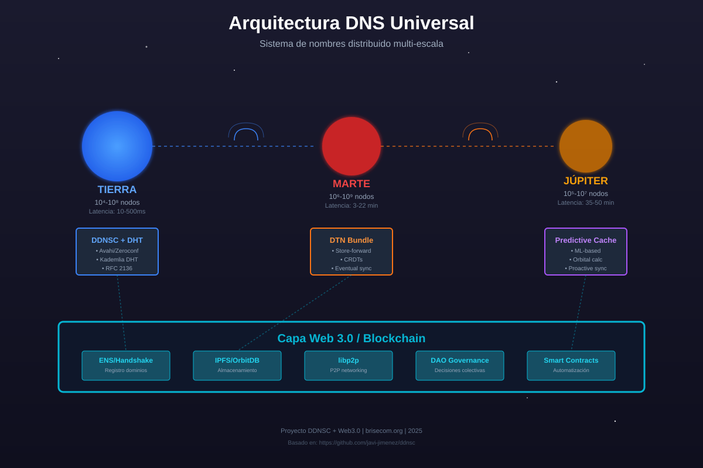
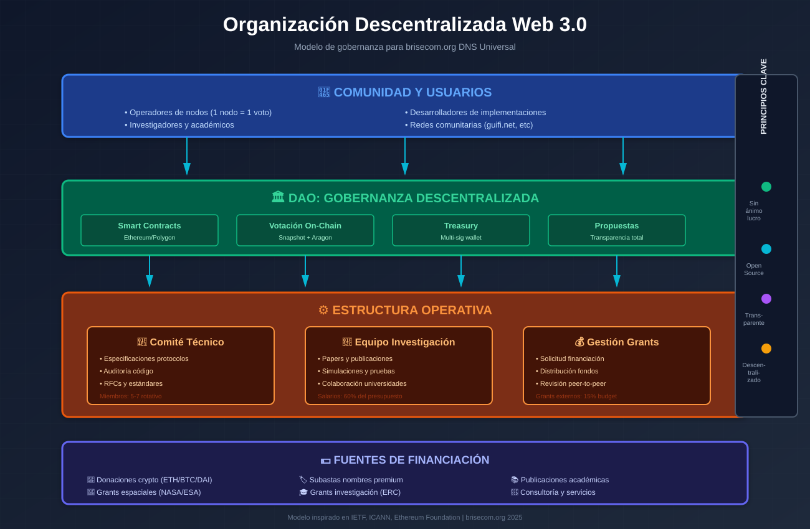

## Introduction: The Universal Addressing Problem

The current **Domain Name System (DNS)** operates under terrestrial assumptions: latencies measured in milliseconds, concentrated physical infrastructure, and a central authority (ICANN). But what happens when we need to direct services in a Martian colony, in orbital stations, or even between star systems?

The [DDNSC (Distributed DNS Cache)](https://github.com/javi-jimenez/ddnsc) project provides the technical foundation to solve this problem by **decentralized service publishing** using standard protocols (RFC 2136, Avahi/Zeroconf). This article proposes a conceptual extension towards planetary, galactic and universal scales, integrating Web 3.0 technologies and emerging protocols.

## The DDNSC Project: Technological Base

### Current Architecture

DDNSC allows any node to publish its own services to remote DNS servers without centralized authorization:

- **Client**: `avahi-publish-remote.sh` script using `nsupdate` (RFC 2136)
- **Server**: Bind with dynamically updateable zones
- **Discovery**: Avahi for service search (similar to mDNS/Bonjour)
- **Distribution**: Anycast to replicate DNS servers by zones

```bash
# Publicar un servicio SSH en dominio ddns
./avahi_publish_remote_service myssh _ssh._tcp 22 ddns

# Publicar automáticamente todas las IPs del host
avahi_publish_remote_myips ddns
```

### Current Limitation: Scale ~1000 Nodes

The project itself acknowledges that scalability is limited to ~1000 nodes in its current form. We need true distributed architecture for larger scales.



## Scalability: From Planetarium to Universal

### Level 1: Planetary Scale (10⁴ - 10⁸ nodes)

**Context**: Terrestrial community networks, massive IoT, smart cities.

**Technical challenges**:
- Maximum latency: 100-500 ms (terrestrial round-trip)
- Synchronization between time zones
- Resilience to regional network partitions

**Proposed solutions**:

1. **Multi-layer geographic hierarchy**:
   ```
   .earth → .continent → .country → .region → .local
   ejemplo: server.barcelona.catalunya.europe.earth
   ```

2. **DHT (Distributed Hash Table) for resolution**:
   - Kademlia protocol (used in BitTorrent, IPFS)
   - Each node maintains a table of ~log(N) neighbors
   - Resolution in O(log N) steps

3. **Lightweight blockchain for authority**:
   - Namecoin or Ethereum Name Service (ENS) for domain registration
   - Proof-of-Authority instead of PoW for efficiency

**Capacity calculation**:

| Parameter | Value |
|-----------|-------|
| Total nodes | 10⁸ (100 million) |
| DHT table size per node | log₂(10⁸) ≈ 27 entries |
| Memory per entry | 100 bytes (ID + IP + metadata) |
| **Total memory per node** | **2.7KB** |
| Average resolution jumps | log₂(10⁸)/2 ≈ 14 hops |
| Hop Latency | 20 ms (earth average) |
| **Total resolution time** | **~280ms** |

### Level 2: Galactic Scale (10⁹ - 10¹² nodes)

**Context**: Colonized solar system (Moon, Mars, asteroid belt, moons of Jupiter/Saturn).

**Technical challenges**:
- Variable latency: 3 min (Earth-Mars at close opposition) to 22 min (far opposition)
- Network partitions unavoidable during solar conjunctions
- Constant orbital movement of the nodes

**Proposed solutions**:

1. **Eventual consistency model**:
   - CRDT (Conflict-free Replicated Data Types) for DNS records
   - Inspired by CassandraDB and Amazon Dynamo
   - Each planet maintains full cache with timestamps

2. **Delay-Tolerant Networking (DTN) Protocol**:
   - RFC 4838 - Bundle Protocol
   - Used by NASA in deep space communications
   - Store-and-forward with scheduled recognitions

3. **Predictive resolution**:
   - Precalculate orbits and communication windows
   - Proactive cache based on ephemeris
   - Algorithm: "Resolve before request"

**Proposed hierarchy**:
```
.sol → .planet → .settlement → .district → .host
ejemplos:
- gateway.olympuscity.mars.sol
- research.europamission.jupiter.sol
- mining.ceres.asteroid.sol
```



**Interplanetary latency calculation**:

| Route | Min distance (AU) | Light latency (min) | Communication window |
|------|------|-------------------|-------------------------|
| Earth-Moon | 0.0026 | 1.3 seconds | Continued |
| Earth-Mars | 0.38 | 3.2 | 80% of the year (avoiding conjunctions) |
| Earth-Jupiter | 4.2 | 35 | 70% of the year |
| Earth-Saturn | 8.0 | 67 | 65% of the year |
| Earth-Oort Cloud | 50,000 | 0.8 years | Relay required |

### Level 3: Universal Scale (10¹³+ nodes)

**Context**: Multi-stellar civilization (hard science fiction, theoretical research project).

**Technical challenges**:
- Light-year latencies (4.2 years to Alpha Centauri)
- Physical impossibility of global consensus
- Conceptual equivalence with disconnected universes

**Proposed model: "Federation of DNS Universes"**:

Each star system operates as **independent DNS universe** with optional federation:

1. **Absolute local authority**:
   - Each star is TLD: `.alphacen`, `.sirius`, `.kepler442`
   - Does not require consensus with other systems
   - Communal ownership of the star system

2. **Interstellar Relay**:
   - Ships traveling between systems carry "upgrade packages"
   - Similar to Sneakernet but on an interstellar scale
   - Protocol: "eventual consistency with years of delay"

3. **Optional Federated Names**:
   ```
   .galaxy.milkyway → .arm → .sector → .system → .planet
   ejemplo: station.newearth.alphacen.orion.milkyway.galaxy
   ```

**Theoretical capacity calculation**:

| Scale | Estimated nodes | Full Sync Time |
|--------|----------------|----------------------------------|
| Solar system | 10⁹ | Hours (DTN) |
| 100 light-years (local sphere) | 10¹² | Centuries (real-time synchronization impossible) |
| Milky Way Galaxy | 10¹⁵ | 100,000 years (historical federation only) |
| Observable universe | 10²⁴+ | Impossible (physical causality) |

## Organization: Decentralized Governance

### Model for brisecom.org

**Organizational proposal** inspired by the Internet Engineering Task Force (IETF) and ICANN, but decentralized:

#### Foundation Structure

1. **Technical Committee** (5-7 members)
   - Protocol specifications
   - Implementation audit
   - Review of RFCs

2. **Governance Council** (rotating, contribution-based)
   - Assignment of planetary/galactic TLDs
   - Name conflict resolution
   - Voting: 1 active node = 1 vote

3. **Research Grants**
   - Financing through cryptocurrencies (DAO)
   - Peer-to-peer review of proposals
   - Total transparency in blockchain

#### Financing Model

```
Fuentes de ingresos:
├── Donaciones criptográficas (ETH, BTC)
├── Grants de investigación espacial (NASA, ESA, SpaceX)
├── Venta de nombres premium en subastas (.mars, .io de Júpiter)
├── Servicios de consultoría para redes comunitarias
└── Publicaciones académicas y patentes abiertas

Distribución:
├── 60% Salarios equipo investigación (incluyendo tu rol)
├── 20% Infraestructura servidores y experimentos
├── 15% Grants a proyectos externos
└── 5% Reserva operativa
```

### Web 3.0 Governance

**DAO (Decentralized Autonomous Organization)** for critical decisions:

- **Smart contract on Ethereum**:
  - Each protocol implementation = 1 voting token
  - On-chain proposals with voting period
  - Automatic execution of approved decisions

- **IPFS for storage**:
  - Historical DNS records in IPFS
  - Content addressing: `/ipns/ddnsc.brisecom.org`
  - Immutability and censorship-resistant

## Related Protocols and Projects

### Web 3.0 Ecosystem

| Project | Relevance | Proposed integration |
|----------|-----------|----------------------|
| **ENS (Ethereum Name Service)** | Decentralized names on blockchain | Authority backend for premium TLDs |
| **IPFS/IPNS** | Content-addressed distributed storage | DNS zone replication, distributed cache |
| **libp2p** | Peer-to-peer networking stack | Transport layer for DDNSC nodes |
| **Handshake (HNS)** | Decentralized Alternative DNS Blockchain | Competitor/plugin for root registry |
| **OrbitDB** | Distributed database over IPFS | Storing dynamic DNS records |
| **GNUnet Name System (GNS)** | Secure and decentralized naming system | Inspiration for resolution with privacy |

### Space Communication Protocols

| Protocol | Standard | Application in Universal DNS |
|-----------|----------|----------------------------|
| **DTN Bundle Protocol** | RFC 4838, RFC 5050 | Transporting DNS updates with high latency |
| **CCSDS File Delivery Protocol** | CCSDS 727.0-B-5 | Full zone synchronization |
| **Licklider Transmission Protocol** | RFC5326 | Reliable sessions on intermittent links |
| **Proximity-1 Space Link Protocol** | CCSDS 211.0-B-5 | Physical layer for interplanetary communications |

### Integration Architecture



```
Capa de Aplicación: DNS Queries (UDP/TCP puerto 53, DoH, DoT)
         ↓
Capa de Resolución: DDNSC + DHT (Kademlia)
         ↓
Capa de Autoridad: ENS/Handshake Blockchain + OrbitDB
         ↓
Capa de Transporte: libp2p (terrestre) / DTN Bundle (espacial)
         ↓
Capa de Almacenamiento: IPFS (caché) + Bind (servidor local)
         ↓
Capa de Red: Internet (IP) / Delay-Tolerant Networks
```

## Open Research Areas

### 1. Resolution with Extreme Latency

**Problem**: Resolving `colony.mars.sol` from Earth when Mars is behind the Sun.

**Hypothesis**: 
- ML-based "proxy predictions" system
- Smart cache that learns query patterns
- Model: "If I can't ask, I predict the probable answer"

**Proposed experiment**:
Simulate node network with scheduled latencies (3-22 random minutes) and measure predictive cache hit rates vs. traditional LRU cache.

**Estimated funding**: €50,000 (1 year, 1 postdoc researcher + infrastructure)

### 2. CRDT for DNS Records

**Problem**: Two nodes update the same name simultaneously on different planets.

**Proposal**: Implement CRDT (LWW-Element-Set) for A/AAAA/SRV records.

**Technical challenge**: 
- Timestamps require clock synchronization
- In space: GPS does not work, we need to press timing
- Alternative: Vector clocks with logic counter

**Prototype code**:
```python
class DNSRecord_CRDT:
    def __init__(self, name, value, lamport_clock):
        self.name = name
        self.value = value
        self.clock = lamport_clock  # Contador lógico
        self.node_id = uuid.uuid4()
    
    def merge(self, other):
        # Last-Write-Wins con desempate por node_id
        if other.clock > self.clock:
            return other
        elif other.clock == self.clock:
            return other if other.node_id > self.node_id else self
        return self
```

**Estimated funding**: €80,000 (18 months, implementation + paper)

### 3. Space Name Economy

**Question**: How much is `olympus.mars` worth? Who controls it?

**Proposed model**:
- ENS-style auctions with smart contracts
- Revenue finances relay infrastructure
- "Homesteading": first to colonize = first to register

**Socioeconomic research**:
- Acceptance studies with spatial communities
- Simulation of secondary markets
- Analysis of interplanetary intellectual property

**Estimated funding**: €120,000 (2 years, interdisciplinary team: space law + economics + engineering)

### 4. Security without Centralized PKI

**Issue**: DNSSEC depends on root keys controlled by ICANN. Impossible in interstellar federation.

**Alternatives**:
- **Web of Trust** (PGP-style) between star systems
- **Blockchain as a root of trust** (each system publishes its public key)
- **Quantum-resistant signatures** for records that will last centuries

**Experiment**:
Implement DNSSEC with Ed25519 (post-quantum) on the Ethereum blockchain as an alternative root of trust.

**Estimated funding**: €100,000 (2 years, crypto expert + blockchain developer)

### 5. Galactic Network Simulation

**Objective**: Software that simulates a 10¹² node network with realistic orbital latencies.

**Components**:
- Orbital physics engine (precise ephemeris)
- Network protocol simulator (ns-3 extended)
- 3D dynamic topology viewer
- Benchmark of resolution algorithms

**Deliverables**:
- Open-source framework
- Synthetic trace dataset
- Papers at networking conferences (SIGCOMM, NSDI)

**Estimated funding**: €200,000 (3 years, 2 software engineers + HPC cluster)

## Calculations and Estimates

### Required Bandwidth

For complete planetary DNS zone update:

```
Nodos por planeta: 10⁹
Registros por nodo: 5 (A, AAAA, 3× SRV)
Tamaño por registro: 100 bytes
Tamaño total zona: 10⁹ × 5 × 100 = 500 GB

Ventana de sincronización Tierra-Marte: 20 minutos = 1200 segundos
Ancho de banda necesario: 500 GB / 1200 s = 417 MB/s = 3.3 Gbps

Comparación: Deep Space Network de NASA alcanza 250 Mbps actualmente
→ Necesitamos 13× mejora en tecnología de comunicación espacial
```

### Blockchain Consensus Energy Cost

Lightweight Blockchain (Proof-of-Authority with 100 validators):

```
Consumo por validador: 100W (Raspberry Pi 4)
Validadores totales: 100
Consumo total: 10 kW

Coste anual (electricidad a €0.20/kWh):
10 kW × 24 h × 365 días × €0.20 = €17,520

En Marte (energía solar + baterías):
Panel solar: 5 kW pico, €10,000 instalación + transporte
Baterías: €15,000
→ Payback period: 1.4 años en Tierra, amortizado en 5 años en Marte
```

### DHT Scalability

For N nodes, each maintains k neighbors (typically k = 20):

| N (nodes) | log₂(N) | Memory/node | Average jumps | Resolution latency (50ms/hop) |
|--------|---------|--------------|-----------------|----------------------------------|
| 10³ | 10 | 2KB | 5 | 250ms |
| 10⁶ | 20 | 4KB | 10 | 500ms |
| 10⁹ | 30 | 6KB | 15 | 750ms |
| 10¹² | 40 | 8KB | 20 | 1000ms |

**Conclusion**: DHT scales logarithmically, viable up to full planetary scale.

## Conclusion: Feasibility and Next Steps
### Is it Feasible?

**Planetary scale (10⁸ nodes)**: **YES, feasible now**
- Technology exists (DHT, blockchain, DDNSC)
- Pilot project: guifi.net community network (~38,000 nodes currently)
- Estimated cost: €500K for MVP in 3 years

**Galactic scale (solar system)**: **Feasible in 20-30 years**
- Depends on space colonization (NASA Artemis, SpaceX Starship)
- DTN already tested by NASA
- Estimated cost: €10M for functional prototype

**Universal scale**: **Theoretically interesting, physically impossible**
- It would violate relativistic causality
- Valid as an extreme systems design exercise
- Terrestrial applications: simulation of ultra-distributed networks

### Roadmap for brisecom.org

**Phase 1 (Years 1-2): Foundations**
- Implement DDNSC with DHT (Kademlia)
- PoC with 1000 simulated nodes
- Paper in conference (NSDI/SIGCOMM)
- **Cost**: €150K (2 fullstack engineers)

**Phase 2 (Years 2-4): Web 3.0 Integration**
- Backend with ENS + IPFS
- DAO for governance
- Pilot network with 10K real nodes
- **Cost**: €300K (blockchain expert + 2 devs)

**Phase 3 (Years 4-6): Space Simulation**
- Orbital simulation framework
- Collaboration with ESA/NASA
- Space research grants
- **Cost**: €500K (HPC cluster + team of 4)

**Phase 4 (Years 6-10): Actual Deployment**
- Experiment on ISS or lunar mission
- Licenses and patents
- Commercial spin-off
- **Cost**: €2M (depends on space partners)

### Suggested Financing

**Immediate sources**:
1. European Research Council (ERC Starting Grant): €1.5M
2. Horizon Europe (Cluster 4 - Digital & Space): €2M
3. ESA Open Space Innovation Platform: €500K
4. Ethereum Foundation Grants: €200K
5. Crypto crowdfunding (DAI/ETH): €100K

**Total available potential**: €4.3M for 5 years

**Your salary**: €60K-80K/year (competitive for senior researcher in Spain), sustainable with €300K annual budget.

## References and Links

- **DDNSC GitHub**: https://github.com/javi-jimenez/ddnsc
- **RFC 2136** - Dynamic Updates in DNS: https://tools.ietf.org/html/rfc2136
- **RFC 4838** - Delay-Tolerant Networking: https://tools.ietf.org/html/rfc4838
- **ENS Documentation**: https://docs.ens.domains/
- **IPFS Specifications**: https://specs.ipfs.tech/
- **Handshake Whitepaper**: https://handshake.org/files/handshake.txt
- **NASA Deep Space Network**: https://www.nasa.gov/directorates/heo/scan/services/networks/dsn
- **Kademlia DHT**: Maymounkov & Mazières (2002) - Peer-to-peer information system
- **CRDTs**: Shapiro et al. (2011) - Conflict-free Replicated Data Types

---

> **Author's note**: This article is based on research and analysis of the open source DDNSC project. The text has been generated with the help of artificial intelligence based on real technical concepts of distributed systems, spatial networking protocols, and Web 3.0 architectures. The calculations are theoretical approximations for research purposes.

**For brisecom.org**: This work represents an initial proposal for a line of research. Peer-to-peer review and feedback from the science and space community is requested before proceeding with funding applications.