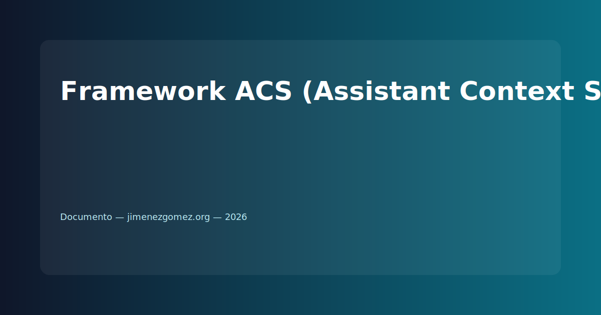

## Motivación

Las IAs actuales operan en silos de memoria efímeros (ventanas de contexto). Esto genera "alucinaciones" por pérdida de datos y falta de trazabilidad en proyectos complejos. El Framework ACS nace para dotar a la IA de una memoria externa estructurada, separando la verdad del usuario del razonamiento de la máquina.

## 1. Arquitectura de Segmentación Lógica

El sistema se basa en la tripartición de la información:

### A. Capa de Axiomas (Documento de Control)

- Definición: Hechos inmutables y reglas de control dictadas por el Usuario.

- Función: Actúa como el "ADN" del contexto. Si no está en el Axioma, no existe para la IA.

- Protocolo: Incluye las bases generales (BH-GEN) y las específicas de investigación (BH-INVESTIGACION).

### B. Capa de Proceso (La IA)

- Definición: Motor de razonamiento lógico.

- Función: Aplica los Axiomas para resolver problemas sin contaminar la base de datos original.

### C. Capa de Inferencias/Hipótesis (Documento de Resultados)

- Definición: El "output" del sistema.

- Función: Registro de análisis, hallazgos y sugerencias. Estos datos son provisionales hasta que el usuario los valide y los traslade a la Capa de Axiomas.

---

Este documento plantea una base minimalista para implementar ACS en flujos que requieran trazabilidad, reproducibilidad y separación explícita entre hechos (Axiomas) y razonamientos provisionales (Inferencias). Las implementaciones concretas pueden añadir metadatos de versión, firmas de autor y mecanimos de validación para transitar inferencias a axiomas de forma controlada.
