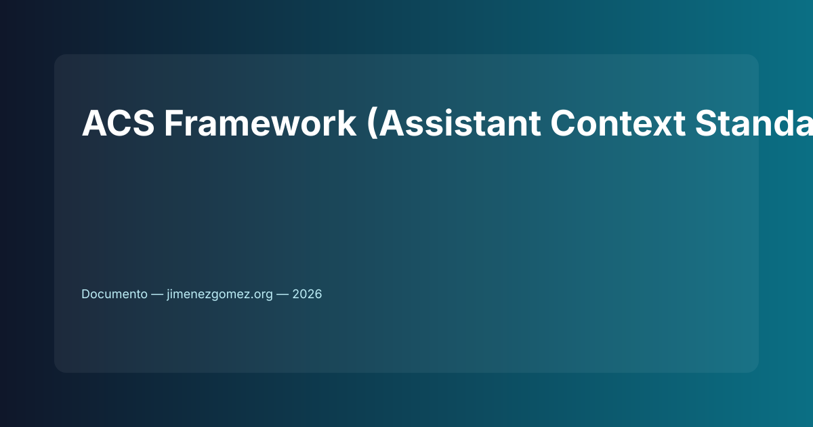

## Motivation
:

Current AIs operate in ephemeral memory silos (context windows). This generates "hallucinations" due to data loss and lack of traceability in complex projects. The ACS Framework was created to provide AI with a structured external memory, separating the user's truth from the machine's reasoning.

## 1. Logical Segmentation Architecture

The system is based on the tripartition of information:

### A. Axiom Layer (Control Document)

- Definition: Immutable facts and control rules dictated by the User.

- Function: Acts as the "DNA" of the context. If it's not in the Axiom, it doesn't exist for AI.

- Protocol: Includes the general bases (BH-GEN) and the specific research bases (BH-INVESTIGATION).

### B. Process Layer (AI)

- Definition: Logical reasoning engine.

- Function: Apply the Axioms to solve problems without contaminating the original database.

### C. Inference/Hypothesis Layer (Results Document)

- Definition: The "output" of the system.

- Function: Record of analysis, findings and suggestions. This data is provisional until the user validates it and transfers it to the Axioms Layer.

---

This document proposes a minimalist basis for implementing ACS in flows that require traceability, reproducibility and explicit separation between facts (Axioms) and provisional reasoning (Inferences). Concrete implementations can add version metadata, author signatures, and validation mechanisms to transition inferences to axioms in a controlled manner.
