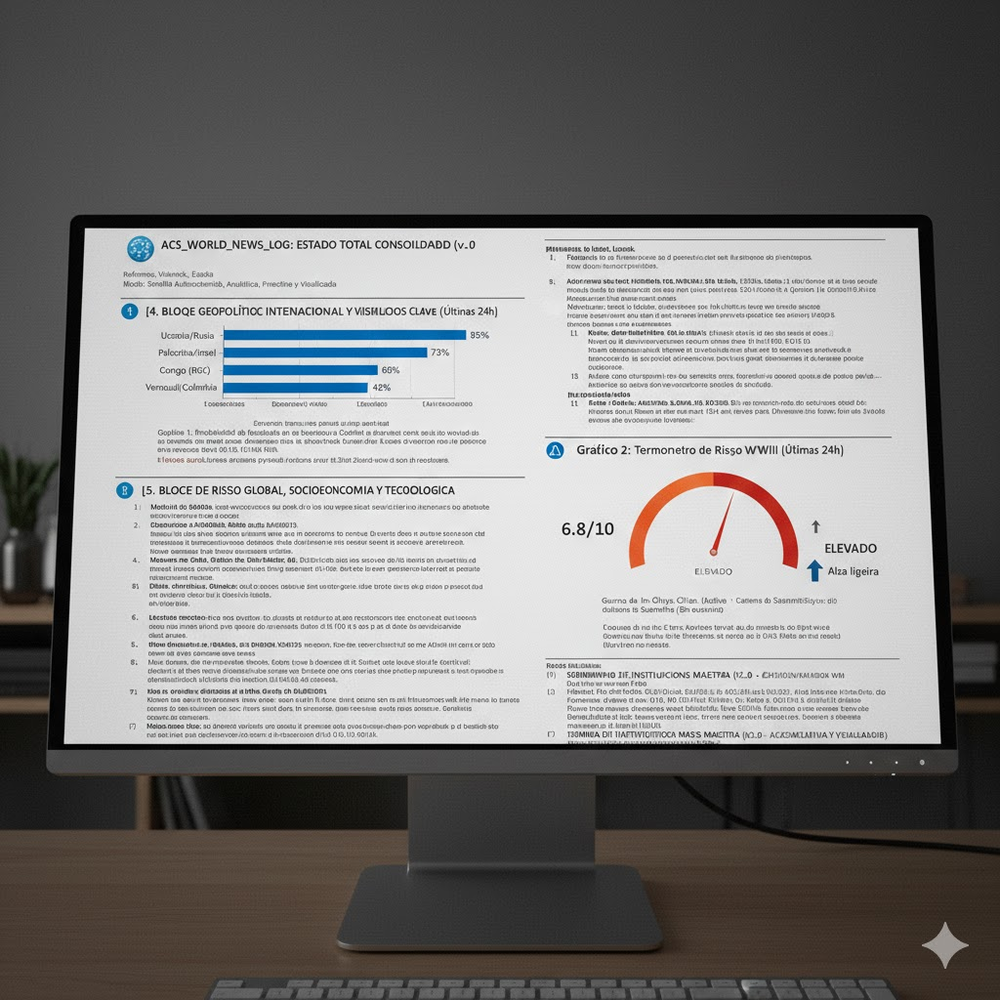

📝 Artículo de Divulgación: "Domando el Caos de la IA"

Abstract: El fin de la amnesia artificial

En un mundo saturado de información, las Inteligencias Artificiales sufren de un mal común: la falta de memoria persistente y estructurada. Presentamos el Framework ACS (Assistant Context Standard), una metodología innovadora que separa los hechos de las suposiciones, permitiendo a empresas e investigadores convertir a la IA en un socio estratégico con memoria infinita y razonamiento trazable.

## La paradoja del genio olvidadizo

Imagine contratar al consultor más brillante del mundo, pero con una condición: cada mañana, al entrar en su oficina, olvida quién es usted y en qué trabajaron ayer. Esa es la realidad de las IAs actuales. El Framework ACS soluciona esto mediante la creación de un "Cerebro Externo".

## De la especulación a la lógica: Axiomas vs. Inferencias

La mayoría de los usuarios "hablan" con la IA esperando que recuerde todo. Nosotros proponemos un cambio de paradigma basado en dos pilares:

- **El Axioma (La Verdad):** Son los datos que usted, como humano, define. "Valencia está en España", "Nuestro presupuesto es X". La IA tiene prohibido dudar de esto.

- **La Inferencia (El Hallazgo):** Es lo que la IA deduce. "Si el presupuesto es X y el precio sube, tenemos un riesgo".

Al separar estos dos mundos, eliminamos el riesgo de que la IA invente hechos. Creamos un sistema donde el humano dicta la realidad y la máquina procesa las posibilidades.

## Aplicaciones: De la Geopolítica a la Inversión

Este sistema permite monitorear desde la logística en Valencia hasta el riesgo de conflicto global (WWIII) con una precisión matemática. Para un inversor, esto significa trazabilidad total: usted sabe exactamente por qué la IA tomó una decisión, basándose en qué axioma específico.

## Conclusión

El Framework ACS no es solo una forma de usar IA; es un estándar de gestión del conocimiento. Es la herramienta que permite pasar de "jugar" con la IA a "gobernar" la información para la toma de decisiones críticas en un mundo volátil.
