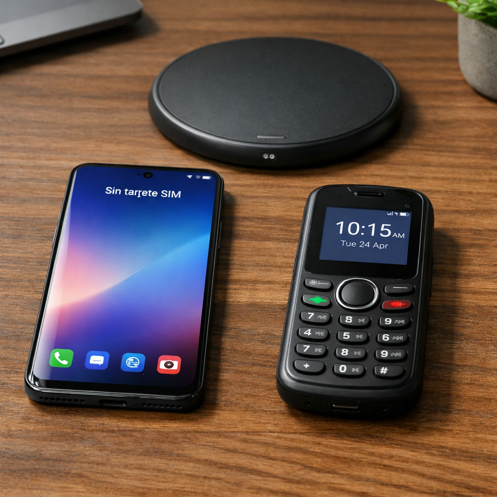

# Resilience in connectivity - The perfect combination: SIM-free smartphone + eternal basic phone

## EXECUTIVE SUMMARY: THE INTELLIGENT DIGITAL DOUBLE LIFE

In the age of hyperconnection, a revolutionary solution is gaining popularity: **using a SIM-free smartphone connected exclusively to WiFi along with a basic phone with a long-lasting battery for calls**. This strategy is not a technological step back, but a **conscious act of digital design** that regains control over our time, attention and productivity.

The methodology is simple but powerful: all contacts are asked to **use the cellular network only for urgent or important calls**, reserving WhatsApp, Telegram and social networks for non-urgent communications that will be attended to at designated times. This physical separation of duties creates natural barriers against constant distraction.

## THE PROBLEM: THE TYRANNY OF THE SINGLE DEVICE

The modern smartphone has become a **schizophrenic device** that combines contradictory functions:

- Productive work tool
- Compulsive entertainment platform
- Essential communication device
- Non-stop notification feed
- GPS navigator and camera

This convergence has a proven cognitive cost: **constant interruptions, inability to concentrate, disconnection anxiety, and reduced sleep quality**. According to studies from the University of California, regaining concentration after a notification can take up to 23 minutes.

## THE TECHNICAL SOLUTION: TWO DEVICES, TWO PURPOSES

### **The SIM-free Smartphone: The Control Center on WiFi**

**Optimal configuration:**
- Physically remove the SIM card
- Activate airplane mode and enable WiFi only manually
- Uninstall social media apps or use web versions
- Maintain useful tools: offline maps, music/podcast player, camera, notes, calendar
- Set up strict “digital focus” schedules

**Immediate advantages:**
- **Zero unexpected cell interruptions:** No one can "invade" your space with calls or messages
- **Data consumption under control:** You only use WiFi in chosen places and times
- **Battery lasts significantly longer:** No constant searching for a cellular signal
- **Physical security:** The device is useless for thieves (without SIM, difficult to resell)

### **The Basic Telephone: The Durable Lifeline**

**Ideal features:**
- Battery with 7-30 days of autonomy
- Physical keyboard or basic touch screen
- Essential functions: calls, SMS, alarm, flashlight
- Rugged design and extreme portability
- Some models allow contact whitelist

**Recommended models:**
- **Nokia 105/110:** Up to 30 days standby, price less than €30
- **CAT B35:** Shock, water and dust resistant, 18 days of battery life
- **Xiaomi Qin 1S:** Minimal touch screen with WiFi hotspot
- **Schok Classic:** Modern flip phone with 7 days of battery

## THE COMMUNICATION PROTOCOL: EDUCATE THE ENVIRONMENT

The effectiveness of the system depends on a **change in communication protocol**:

### **Standard message for contacts:**
"*I have reorganized my devices to improve my concentration. For urgent or important calls, use my number [basic phone number]. For everything else (messages, files, coordination), use WhatsApp/Telegram which I will check at specific times. Thank you for understanding!*"

### **Clear rules of use:**
1. **Basic phone:** Only in pocket during work hours or essential outings
2. **Smartphone without SIM:** At home or office, connected to WiFi at established times
3. **Different response times:**
- Calls to the basic telephone: immediate response (emergencies)
   - Messages in apps: response in 30-minute windows, 2-3 times a day

## DEMONSTRATED TANGIBLE BENEFITS

### **Productivity and Mental Health:**
- **70-80% reduction in interruptions** during deep work hours
- **Recovery of attentional control:** Less change in cognitive context
- **Decreased digital anxiety:** No pressure to respond immediately
- **Improved sleep:** The basic phone does not invite nighttime scrolling

### **Practical and Economic Aspects:**
- **Economic savings:** Reduced or eliminated data plan (WiFi only)
- **Security:** In case of theft, the smartphone without SIM has limited value
- **Travel Connectivity:** Temporary eSIM only when essential
- **Infinite battery:** Never again the anxiety of 1% in the middle of the afternoon

### **Relational:**
- **Communicational quality:** Calls regain their importance and value
- **Healthy limits:** Schedules and response times are respected
- **Real presence:** Less temptation to check your phone at social gatherings

## STEP BY STEP IMPLEMENTATION

### **Week 1: Transition**
1. Buy basic phone and transfer main number
2. Remove SIM from the smartphone and configure airplane mode + WiFi
3. Notify 10 key contacts about the new system

### **Week 2: Adjustment**
1. Uninstall distracting apps from your smartphone
2. Set up an answering machine for non-urgent calls
3. Set app review times (ex: 12:00, 18:00, 21:00)

### **Week 3-4: Consolidation**
1. Extend notification to all contacts
2. Optimize settings of both devices
3. Evaluate and adjust schedules according to real needs

## FREQUENT OBJECTIONS AND SOLUTIONS

### **"What if there is an emergency outside of WiFi?"**
- The basic phone always answers calls
- You can use temporary eSIM if you need data urgently
- Public places (cafes, libraries, shopping centers) offer WiFi

### **"It is very uncomfortable to carry two devices"**
- The basic phone weighs less than 100g and fits in any pocket
- The smartphone without SIM can stay in a backpack/bag and be used only when necessary
- Cognitive comfort compensates for slight physical discomfort

### **"My contacts are not going to adapt"**
- Most respect clear systems when explained politely
-Those who insist on calling for trivialities gradually learn
- Automatically filter relationships according to your limits

## REAL SUCCESS STORIES

### **Creative professionals:**
Designers, writers and programmers report **40% increases in productivity** on tasks that require deep concentration.

### **People with digital anxiety:**
Users suffering from "phantom vibration syndrome" report **complete disappearance of symptoms** in 3-4 weeks.

### **Families with children:**
Parents set the basic phone as an always-available “family line,” while limiting their exposure to unnecessary screens.

## CONCLUSION: DIGITAL SOVEREIGNTY RECOVERED

This dual strategy is not a renunciation of technology, but a **conscious evolution** in our relationship with it. By physically separating the urgent communication functions (calls) from asynchronous communication (apps), we recover:

1. **Attentional autonomy:** We decide when and how we connect
2. **Peace of mind:** Without the constant buzz of notifications
3. **Quality communication:** Calls regain meaning
4. **Real efficiency:** Messages are responded to in batches, not interrupting workflows

The SIM-free smartphone becomes what it should always be: **a powerful tool under our control**, not a distributor of interruptions. The basic telephone fulfills its ancestral function with unbeatable efficiency: **connecting us when it really matters**.
In a world that glorifies hyperconnection, this strategic separation represents true modern luxury: **control over our time and attention**. It is not about living with less technology, but with more intelligently distributed technology.

---

*Have you tried a similar system? The transition requires adjustment, but the benefits in productivity and mental well-being are worth every effort. Technology should serve us, not enslave us.*