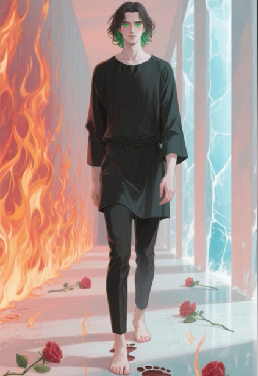

Texto inspirado en tradiciones valencianas, psicografías y símbolos esotéricos. Parte del texto fue elaborado con ayuda de modelos (ej. Google Gemini) y contraste histórico.

## Introducción

La figura del Encubierto —L'Encobert en valenciano— es uno de esos mitos que condensan historia, profecía y simbolismo. Surgida en torno a las Germanías del siglo XVI, su presencia en el imaginario popular valenciano persiste como arquetipo: un joven humilde que encarna una esperanza radical de cambio en tiempos de catástrofe.

## Origen histórico: las Germanías

El mito nace en 1522, en el contexto de la Rebelión de las Germanías. Un personaje misterioso, presentado como heredero oculto de linaje real, aparece como líder mesiánico y promesa de justicia social. Tras su muerte violenta, la figura se transformó en símbolo y leyenda, reapareciendo en relatos y vaticinios posteriores.

## Tradición profética y ecos mediterráneos

Las corrientes proféticas del área —textos atribuidos a autores medievales, sermones populares y manuscritos locales— alimentaron la visión del Encubierto como un 'cargo' místico que se manifiesta cuando la tierra y la comunidad lo requieren. En versiones esotéricas modernas, el personaje se describe como un asceta: ropa oscura, descalzo, pelo medio largo y ojos que denotan una visión distinta del mundo.

## Conexiones contemporáneas: Parravicini y el arquetipo

Psicografías como las de Benjamín Solari Parravicini y otras visiones modernas ofrecen paralelos: el "hombre gris" o los jóvenes visionarios aparecen como heraldos de una transformación espiritual. Rasgos como los ojos verdes se vuelven metáforas de visión interior, y el atuendo negro se interpreta en clave alquímica (nigredo), no necesariamente como signo de maldad.

## Simbolismo: descalzo, negro, ojos verdes

- El negro: etapa de "muerte" del ego y preparación para la transmutación.
- Descalzo: contacto directo con la tierra, humildad y purificación territorial.
- Ojos verdes: asociacion a la "luz esmeralda" del conocimiento oculto o una visión no ordinaria.

Estas imágenes combinadas crean al Encubierto como el Puer Aeternus místico: un joven-errante que aparece para corregir el curso de la historia cuando las estructuras fallen.

## Valencia como epicentro simbólico

Los relatos locales vinculan a Valencia con catalizadores espirituales (Santo Cáliz, cánticos litúrgicos como el Canto de la Sibila) y lugares de prueba. En círculos esotéricos se afirma que cualquier manifestación pública del Encubierto tendría conexiones con la Catedral y los viales históricos de la ciudad.

## Lecturas y fuentes para profundizar

- Documentos y crónicas de las Germanías (archivos municipales y eclesiásticos).
- Psicografías y dibujos de Parravicini (comparativas simbólicas).
- Estudios sobre Joaquín de Fiore, Arnau de Vilanova y el imaginario apocalíptico en el Mediterráneo.

## Reflexión final

El Encubierto funciona como figura liminal: mezcla de rey oculto, asceta y salvador profético. Más que una persona singular, representa una expectativa colectiva de renovación radical que reaparece en distintos momentos de crisis. Su descripción (joven de negro, descalzo, ojos verdes, media melena) es hoy una imagen potente que recoge huellas históricas y capas simbólicas que atraviesan lo político, lo religioso y lo místico.

Si quieres, puedo:

- Añadir versión PNG/OG de las imágenes.
- Traducir el texto al valenciano o inglés.
- Ampliar con citas de archivos e índices de referencia.
