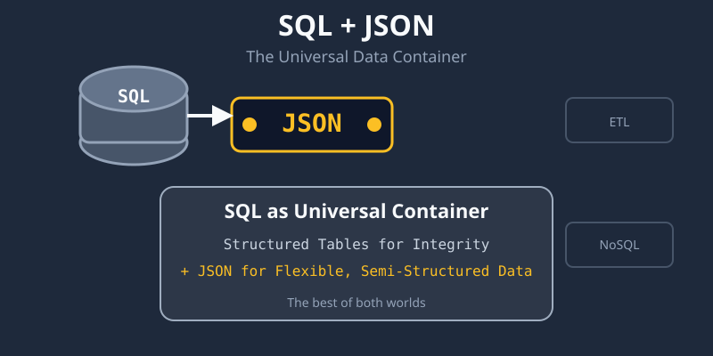

In the past decade, the tech world has been divided by a seemingly endless debate: SQL vs. NoSQL. We've seen endless articles pitting them as opponents, as if you had to choose one. But in practice, the most robust and flexible architectures don't choose. They combine.

After years of working on projects that span from community networks to AI agents, I've found a practical pattern that works: **using SQL as the universal container and JSON as the flexible payload**. It's not a new idea, but it's often overlooked in favor of more dogmatic approaches.

Here's why this matters.

---

## 🧩 The Problem with The Debate

The problem is that the SQL vs. NoSQL debate forces a false dichotomy. NoSQL databases like MongoDB are great for flexibility. They let you store data without a predefined schema. If you need a new field, you just add it. However, they can struggle with complex transactions and reporting. SQL databases like PostgreSQL are powerful and reliable. They enforce data integrity and are excellent for querying relationships. But changing the schema can be a pain.

So you end up with a trade-off: **flexibility or integrity?** But what if you didn't have to choose?

---

## 💡 The Solution: The Container Pattern

The solution is to use SQL as the **container** and JSON as the **payload**. This is the architecture I've used in projects like **laia** and **gcodis**, where data comes from diverse sources and needs to be processed, stored, and analyzed.

The core idea is simple:

1.  **The SQL Table:** Create a simple table with a primary key and a JSON column.
2.  **The Flexible Payload:** Store all the variable data as a JSON object in that column.
3.  **The Transformation:** Use SQL's ETL capabilities to parse, transform, and load this data into more structured tables as needed.

---

## 🛠️ A Practical Example

Imagine you are ingesting data from an AI agent or a community network log. The data is messy. Some entries have a `user_id`, some have a `device_id`. The fields change over time. Instead of updating the schema of a database table for every small change, you store the raw data in a JSON column.

You can then use a simple ETL process to transform and normalize this data into a more structured form for analysis.

```sql
-- Ingest raw data
INSERT INTO raw_data (source, payload)
VALUES ('agent_laia', '{"user_id": 123, "action": "login"}');

-- Transform and load for reporting
INSERT INTO user_actions (user_id, action)
SELECT payload->>'user_id', payload->>'action'
FROM raw_data
WHERE payload ? 'user_id';
```

---

## ✅ Why This Works

This pattern offers several advantages:

- **Flexibility**: You can store data from multiple sources without worrying about schemas.
- **Simplicity**: You don't need complex migration scripts for every little change.
- **Reliability**: You still have the ACID properties of SQL for your core data.
- **Performance**: With indexing on JSON fields (like JSONB in PostgreSQL), queries are still fast.
- **Observability**: You keep a complete audit trail of the raw data.

---

## 📜 A Bit of History

I first encountered this pattern when working with large-scale community network projects like **Clommunity and CONFINE**. We had to integrate data from various sensors, services, and user logs. A rigid SQL schema would have been a bottleneck. A NoSQL-only approach would have made reporting very difficult.

The solution was to store the raw data as it arrived in a PostgreSQL JSONB column and then use ETL pipelines to normalize it for specific use cases. The same approach has proven valuable in my work on **AI and automation**, where the needs of the system often evolve faster than a database schema can be safely changed.

---

## 🏗️ So, SQL or NoSQL?

The answer is **both**. Use SQL for what it does best: integrity, transactions, and querying. Use JSON for what it does best: storing semi-structured data without ceremony. The container pattern is not about choosing a single tool. It's about building a more practical, resilient architecture.

It's a lesson learned from years of working on real projects.
